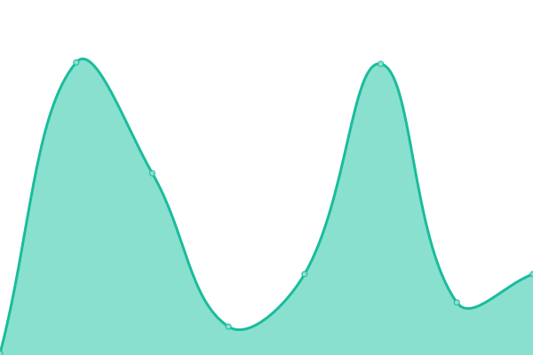

# [📈 Live Status](https://DevMirza-Blog.github.io/status): <!--live status--> **🟥 Complete outage**

This repository contains the open-source uptime monitor and status page for [DevMirza-Blog](https://DevMirza-Blog.github.io/status), powered by [Upptime](https://github.com/upptime/upptime).

With [Upptime](https://upptime.js.org), you can get your own unlimited and free uptime monitor and status page, powered entirely by a GitHub repository. We use [Issues](https://github.com/DevMirza-Blog/status/issues) as incident reports, [Actions](https://github.com/DevMirza-Blog/status/actions) as uptime monitors, and [Pages](https://DevMirza-Blog.github.io/status) for the status page.

<!--start: status pages-->
<!-- This summary is generated by Upptime (https://github.com/upptime/upptime) -->
<!-- Do not edit this manually, your changes will be overwritten -->
<!-- prettier-ignore -->
| URL | Status | History | Response Time | Uptime |
| --- | ------ | ------- | ------------- | ------ |
|  [Blog](https://blog-devmirza.vercel.app/) | 🟥 Down | [blog.yml](https://github.com/DevMirza-Blog/status/commits/HEAD/history/blog.yml) | 

 2330ms
     
 | 

<a href="https://DevMirza-Blog.github.io/status/history/blog">0.00%</a>
    

|  [Blog Backend (netlify)](https://devmirza-blog-backend-production.up.railway.app/admin) | 🟥 Down | [blog-backend-netlify.yml](https://github.com/DevMirza-Blog/status/commits/HEAD/history/blog-backend-netlify.yml) | 

 123ms
     
 | 

<a href="https://DevMirza-Blog.github.io/status/history/blog-backend-netlify">0.00%</a>
    

|  [Blog Backend](https://devmirza-blog-zaid-maker.koyeb.app/) | 🟥 Down | [blog-backend.yml](https://github.com/DevMirza-Blog/status/commits/HEAD/history/blog-backend.yml) | 

 69ms
     
 | 

<a href="https://DevMirza-Blog.github.io/status/history/blog-backend">0.00%</a>
    

<!--end: status pages-->

[**Visit our status website →**](https://DevMirza-Blog.github.io/status)

## 📄 License

- Powered by: [Upptime](https://github.com/upptime/upptime)
- Code: [MIT](./LICENSE) © [DevMirza-Blog](https://DevMirza-Blog.github.io/status)
- Data in the `./history` directory: [Open Database License](https://opendatacommons.org/licenses/odbl/1-0/)
